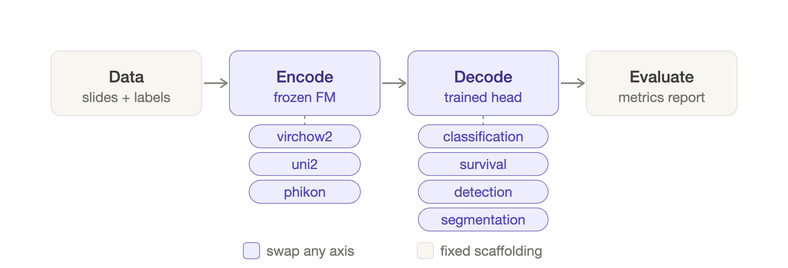

# soma

`soma` runs computational pathology experiments from images and labels to predictions, metrics, and reports. It combines preprocessing, frozen foundation-model features, and downstream training through a modular Python API or a YAML pipeline.

<p align="center">
  
</p>

**[Documentation](https://clemsgrs.github.io/soma)** · **[PyPI](https://pypi.org/project/soma-pathology/)**

## Install

Requires Python 3.11 or later:

```bash
pip install soma-pathology
```

The distribution is `soma-pathology`; the Python package and CLI are `soma`.

## Run an experiment

For slide classification, prepare two CSV files:

- `dataset.csv`: one row per slide with a unique `sample_id`, an `image_path`, and a `label`.
- `splits.csv`: columns `sample_id`, `split`, and `fold`, assigning every sample to `train`, `tune`, or a `test*` split in each fold.

Use independent subjects across splits and include both classes in each split for binary AUROC. The [getting started guide](https://clemsgrs.github.io/soma/getting-started.html) shows the manifests and a complete walkthrough.

```python
from soma import (
    AggregatorConfig,
    EncoderConfig,
    EvalConfig,
    Pipeline,
    PipelineConfig,
    TaskConfig,
    TrainingConfig,
)

config = PipelineConfig(
    dataset_csv="dataset.csv",
    splits_csv="splits.csv",
    output_root="output",
    dataset_type="slide",
    encoder=EncoderConfig(name="phikon"),
    aggregator=AggregatorConfig(name="abmil"),
    task=TaskConfig(name="binary_classification"),
    training=TrainingConfig(epochs=5, learning_rate=1e-4, seed=0),
    evaluation=EvalConfig(metrics=["auroc", "balanced_accuracy"]),
)
result = Pipeline(config).run()
print(result.summary)
print(result.run_dir)
```

`phikon` weights are public and download on first use. Omitted tile size and spacing resolve from the encoder's native configuration. The pipeline preprocesses slides, extracts features, trains across folds, and evaluates predictions. `result.fold_results` contains per-fold results; `result.run_dir` locates the saved artifacts.

To reuse features across experiments, use `Dataset` and `Splits` to load data, `FeatureExtractor.extract()` to build a feature source, and `train()` or `train_one_fold()` for downstream training. The [API guide](https://clemsgrs.github.io/soma/api.html) shows this workflow and reporting examples.

## Use the CLI

Run the same pipeline from a YAML config:

```bash
soma config.yaml
# Equivalent:
python -m soma config.yaml
```

soma merges the file with its bundled defaults. Start with the [task examples](examples/README.md) or consult the [CLI and configuration reference](https://clemsgrs.github.io/soma/cli.html). Discover components with:

```bash
soma list encoders --level tile
soma list aggregators
soma list decoders
soma list pixel-classifiers
soma list tasks
soma list benchmarks
```

## Explore

- [How soma works](https://clemsgrs.github.io/soma/how-soma-works.html): pipeline components and experiment design.
- [Modeling paths](https://clemsgrs.github.io/soma/modeling.html): tile, slide, patient, and dense prediction workflows.
- [Tutorials](https://clemsgrs.github.io/soma/tutorials/index.html): task-specific walkthroughs.
- [Benchmarking](https://clemsgrs.github.io/soma/benchmarking.html): fixed protocols and encoder comparisons, including [task-free CRoMa evaluation](https://clemsgrs.github.io/soma/api.html#task-free-representation-evaluation).
- [Caching](https://clemsgrs.github.io/soma/caching.html) and [run outputs](https://clemsgrs.github.io/soma/outputs.html): feature reuse and experiment provenance.

## License

[Apache-2.0](LICENSE).
